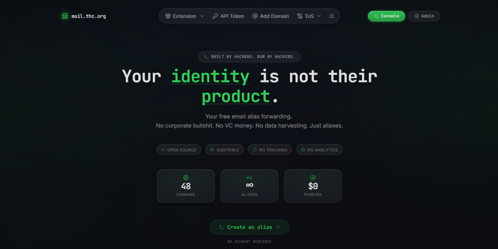

<div align="center">

# mail.thc.org UI

**Made in Brazil 🇧🇷**



A privacy-first, operator-grade frontend for email alias forwarding, API-driven alias automation, and lightweight mail administration.

<p>
  <a href="https://mail.thc.org/">Live Site</a>
  ·
  <a href="https://github.com/haltman-io/mail-forwarding-ui/issues">Issues</a>
  ·
  <a href="https://github.com/haltman-io/mail-forwarding-ui/pulls">Pull Requests</a>
</p>

<p>
  
  
  
  
  
  
  
  
</p>

</div>

---

## Overview

Mail Forwarding UI is a Next.js application for a privacy-focused alias forwarding service. It combines a sharp public-facing console with an operator dashboard, making it easy to create, confirm, and remove aliases while keeping the product surface direct, auditable, and intentionally light on ceremony.

The goal is simple: make alias forwarding feel credible, modern, and fast without turning it into generic SaaS noise. The interface is dark, terminal-led, and built around the details that matter most for this kind of product: domains, routing, API access, DNS, and control.

## Features

- Public alias console with create, delete, and cURL workflows.
- Email confirmation flow for activating new aliases.
- Domain picker with optional fallback domains and custom address mode.
- API token flow for programmatic alias automation.
- DNS setup helper for onboarding domains cleanly.
- Browser add-on entry points for companion extension workflows.
- Admin workspace for domains, aliases, handles, bans, API tokens, and users.
- Privacy and abuse pages integrated into the product surface.
- Live service stats pulled from the backing API.
- Static-export friendly build output for straightforward hosting and release rollouts.

## Interface


The landing experience is deliberately technical: deep dark surfaces, restrained neon green accents, monospace hierarchy, and a glass-layered shell that feels closer to a console than a marketing site. Trust signals stay visible instead of hidden in a footer, and the primary action stays obvious from the first screen.

The result is a UI tuned for privacy-conscious users, hackers, developers, and operators who want a fast route to alias management without unnecessary friction.

## Stack

| Layer | Choice | Notes |
| --- | --- | --- |
| Framework | Next.js 16 | App Router-based public pages, console, and dashboard routes |
| UI | React 19 + TypeScript | Typed, component-driven interface |
| Styling | Tailwind CSS 4 | Responsive layout, design tokens, glass surfaces |
| Primitives | Radix UI patterns | Accessible dialogs, menus, tabs, tables, popovers |
| Feedback | Sonner | Inline status and toast messaging |
| Motion | Motion + GSAP | Interaction polish where it adds clarity |
| Icons | Lucide React | Consistent iconography across product surfaces |
| Delivery | Static export | `next build` produces deployable output in `out/` |

The codebase follows a feature-oriented shape: route shells live in `app/`, shared UI lives in `components/`, and product workflows are grouped in `features/` for alias console, DNS setup, and dashboard administration.

## Getting Started

To run the project locally, you will need:

- Node.js `20+`
- `npm`
- A reachable mail-forwarding API endpoint
- Optionally, a fallback list of handled domains for local testing

If the API is not available during development, the UI can still fall back to `NEXT_PUBLIC_DOMAINS` for domain selection.

## Installation

```bash
git clone https://github.com/haltman-io/mail-forwarding-ui.git
cd mail-forwarding-ui
npm ci
cp .env.example .env.local
```

Update `.env.local` with the correct API host and any domain fallback values before starting the app.

## Development

Start the local development server:

```bash
npm run dev
```

The app will be available at `http://localhost:3000`.

Useful checks during development:

```bash
npm run lint
npm run typecheck
```

If you want the floating debug toolbar locally, set:

```env
NEXT_PUBLIC_DEBUG_UI=true
```

## Build

Create a production build:

```bash
npm run clean
npm run build
```

This project is configured for static export, so the build artifact is generated in `out/`.

That makes it easy to:

- serve the app from a static host
- ship release folders with simple rollback strategies
- plug into the deploy scripts already provided in `.deploy/`

## Project Structure

```text
app/                          # App Router pages, layouts, public routes, dashboard routes
components/                   # Shared UI primitives and site-level components
features/alias-console/       # Public alias creation, delete, confirm, and cURL flows
features/dashboard/           # Admin and operator-facing workflows
features/dns-setup-menu/      # DNS validation and setup helpers
hooks/                        # Reusable hooks
lib/                          # API host config, utilities, DNS/domain helpers
public/                       # Static public assets
.deploy/                      # Bootstrap, deploy, and rollback scripts
.github/assets/docs/          # README and documentation assets
```

## Environment Variables

Use `.env.local` for local configuration:

```env
# Base URL for the mail-forwarding API. No trailing slash.
NEXT_PUBLIC_API_HOST=https://mail-forwarding-api.example.com

# Optional comma-separated fallback list when /domains is unavailable.
NEXT_PUBLIC_DOMAINS=alias1.example.com,alias2.example.com

# Enables the floating debug toolbar in local development only.
NEXT_PUBLIC_DEBUG_UI=false
```

### Variable Notes

- `NEXT_PUBLIC_API_HOST`: The frontend API base URL used for stats, alias flows, DNS helpers, admin auth, and token operations.
- `NEXT_PUBLIC_DOMAINS`: A fallback list used when the backend cannot return available domains.
- `NEXT_PUBLIC_DEBUG_UI`: Development-only UI debugging aid.

## Customization

Mail Forwarding UI is easy to adapt without tearing through the whole app.

- Update landing-page messaging, trust chips, and manifesto content in `components/hero-section.tsx`.
- Adjust top-level navigation and external links in `components/site-header.tsx`.
- Tune colors, glass effects, spacing, and typography tokens in `app/globals.css`.
- Extend public alias workflows in `features/alias-console/`.
- Add or reshape operator tools in `features/dashboard/`.
- Point the UI to a different backend through `.env.local` and `lib/api-host.ts`.

## Roadmap

- Broader automated test coverage for console and dashboard flows.
- Richer admin metrics and audit-oriented views.
- Deeper DNS onboarding and diagnostics.
- Expanded browser add-on integration and documentation.
- Stronger self-hosting and deployment guides.
- Continued UX refinement for high-speed alias workflows.

## Contributing

Contributions are welcome, especially around:

- privacy-first UX
- operator dashboard improvements
- accessibility and interaction polish
- deployment and self-hosting documentation
- API integration quality

A good contribution flow looks like this:

1. Fork the repository and create a focused branch.
2. Install dependencies with `npm ci`.
3. Run the app locally with `npm run dev`.
4. Validate changes with `npm run lint`, `npm run typecheck`, and `npm run build`.
5. Open a pull request with a clear summary and screenshots for UI changes.

Small, sharp improvements are preferred over broad, unfocused rewrites.

## License

This project is released into the public domain under the Unlicense. See `LICENSE` for the full text.

## Feedback

If you're building privacy-respecting mail infrastructure, improving alias workflows, or you spot rough edges in the interface, open an issue, start a discussion, or send a pull request. Thoughtful bug reports, UX critiques, docs fixes, and frontend refinements all move the project forward.

## Credits

<table>
  <tr>
    <td align="center" width="33%">
      <a href="https://github.com/haltman-io">
        <br />
        <strong>Haltman.IO</strong>
      </a>
      <br />
      Brazilian hacking crew
    </td>
    <td align="center" width="33%">
      <a href="https://github.com/hackerschoice">
        <br />
        <strong>The Hacker's Choice</strong>
      </a>
      <br />
      Legendary hacking crew
    </td>

  </tr>
</table>

<table>
  <tr>
    <td align="center" width="33%">
      <a href="https://github.com/Lou-Cipher">
        <br />
        <strong>Lou-Cipher</strong>
      </a>
      <br />
      THC member, creator of the project
    </td>

  </tr>
</table>